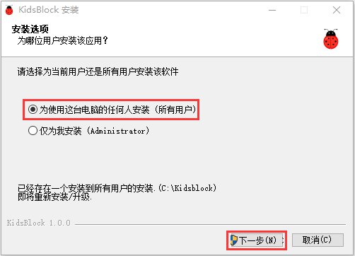
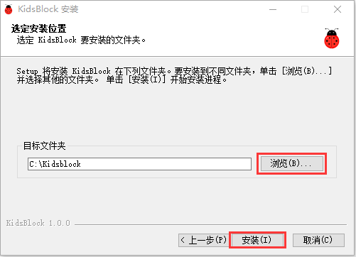
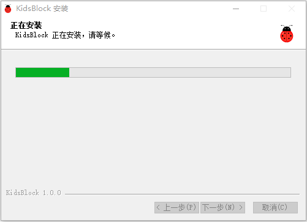
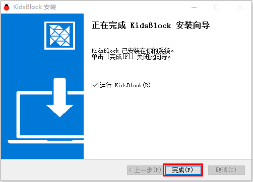
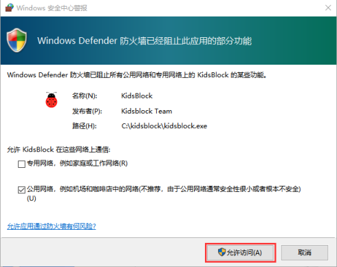
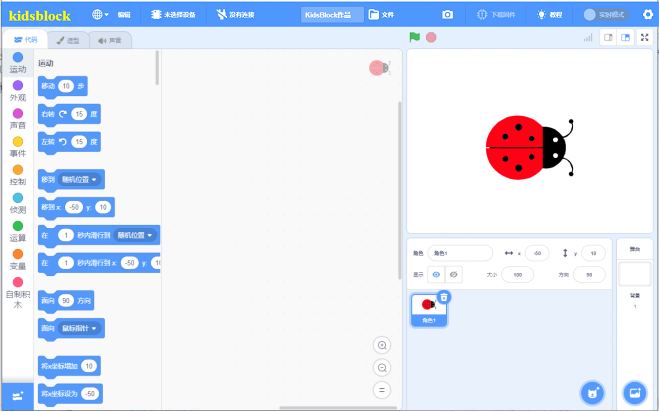
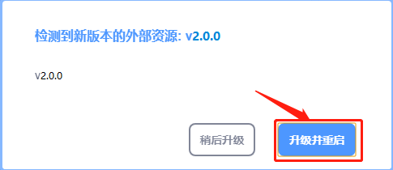
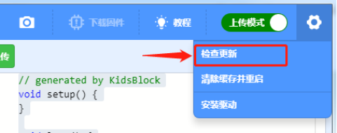

# 1.KidsBlock软件安装说明书--Windows
注意：这里是以Windows系统为例

1. 先下载kidsblock软件，下载链接：[https://www.kidsblock.cn/Down/KidsBlock.exe](https://www.kidsblock.cn/Down/KidsBlock.exe)，  
下载之后，双击下载好的软件“KidsBlock Desktop.exe”。 

2. 先选中“**为使用这台电脑的任何人安装**”，再点击“**下一步**”。

3. 先点击“**浏览（B）...**”,选择安装的位置（我这里选择安装在C盘，你也可以选择安装在电脑的其他盘），再点击“**安装**”。这样，软件就在安装过程中。

4. 几秒种后，安装完成。点击“**完成**”就可以打开安装好的软件。

5. 如果出现电脑安全警报窗口，点击“**允许访问**”。这样就可以打开了软件页面。

6. 有更新软件时一般打开会自动提醒，为了软件能正常使用我们选择升级。

我们也可在设置中手动更新软件

如果已经是最新版本则显示

