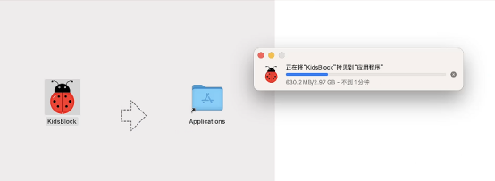
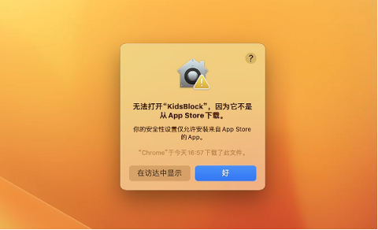
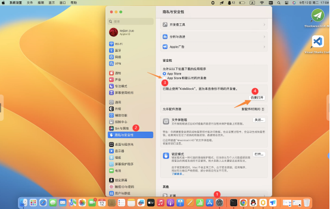
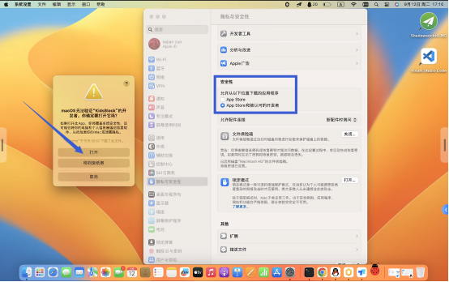
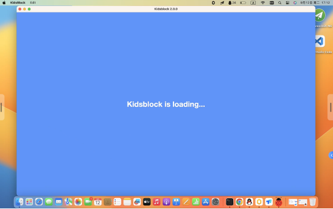
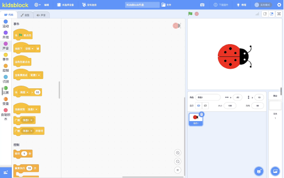

# 3. KidsBlock软件安装说明书--MacOS
注意：这里是以MacOS系统为例

1. 先下载kidsblock软件，下载链接：[https://www.kidsblock.cn/Down/KidsBlock-MACOS.dmg](https://www.kidsblock.cn/Down/KidsBlock-MACOS.dmg) ，下载之后电脑有一个安装程序的图标，如下图。

2. 双击KidsBlock的图标，出现下图，然后按住鼠标左键将KidsBlock拖动到Applications里。

3. 正在将kidsblock程序安装到电脑。

4. 安装完成后点击启动台，可以看到安装好的KidsBlock软件图标。

5. 点击KidsBlock软件图标启动软件，显示无法打开，是因为苹果电脑默认只允许安装App Store里的软件，其他的软件不允许安装。我们需要修改电脑的设置来启动软件。

6. 打开电脑的设置界面，点击隐私和安全性，把安全性那里的选项切换到“App Store和被认可的开发者”，然后点击“仍要打开”。

7. 点击“打开”把已经被阻止的软件重新打开。

8. 完成这些配置之后，软件可以正常启动了。

9. 启动之后的软件界面是这样的，快享受自己的编程之旅吧。

