# KidsBlock软件的驱动安装方法和使用方法

1.软件中各按钮的功能：

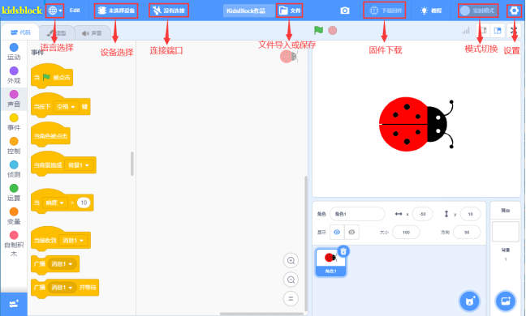

2.点击可以选择语言“**English**”或“**简体中文**”。

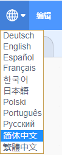

3.点击，选择点击“**安装驱动**”，安装驱动。（注意：如果电脑已经安装了驱动程序，则不需要再安装驱动；如果没有，则需要进行以下操作）

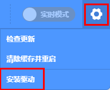

A.在“**设备驱动程序安装向导**”页面选择点击“**下一页**”。

B.过一会儿，选择点击“**完成**”。

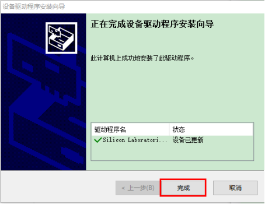

C.选择点击“**下一页**”。

D.选择点击“**完成**”。

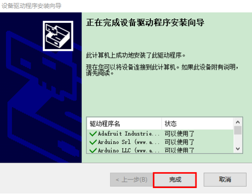

E.如果出现安全页面，选择点击“**允许**”即可，然后选择点击“**Install**”。

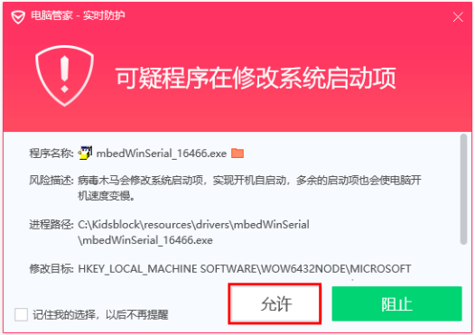

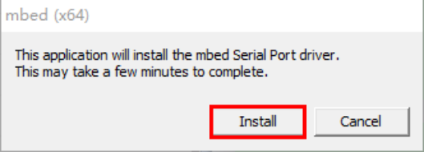

F.选择点击“**安装**”。

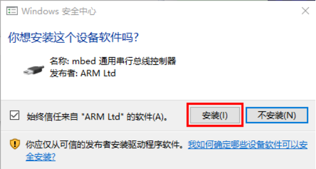

G.过一会儿，点击“**Finish**”。

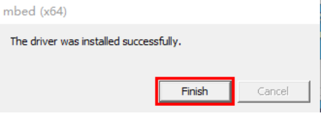

H.选择点击“**Extract**”。

I.选择点击“**下一页**”。

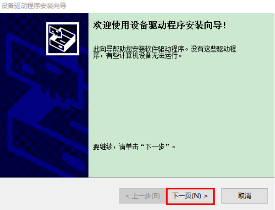

J.选择点击“**我接受这个协议**”后，点击“**下一页**”。

K.选择点击“**完成**”。

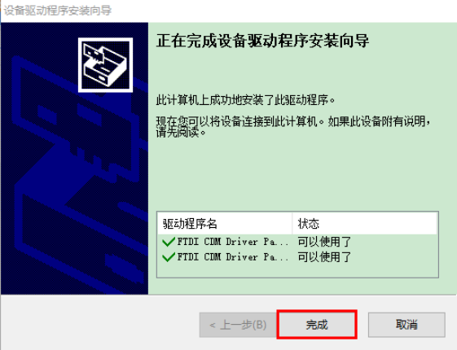

L.选择“**安装**”。

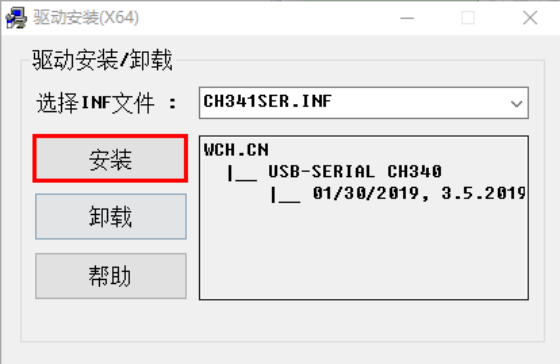

M.过几秒钟后，驱动安装完成，点击“**确定**”即可。

4.驱动安装完后，点击进入主控板页面，可以选择需要添加的设备（控制板）。本项目需要选择Keyes Plus development board，先点击Keyes Plus development board，然后点击“**连接**”，这样Keyes Plus development board已连接上，点击“**返回编辑器**”回到编码编辑器。这样，我们会发现变成，同时变成，说明Keyes Plus development board和端口（COM）都已经连接上了。

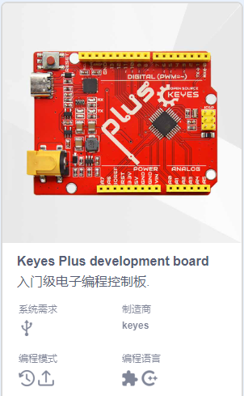

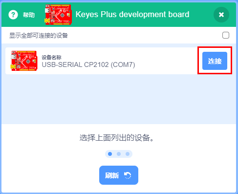

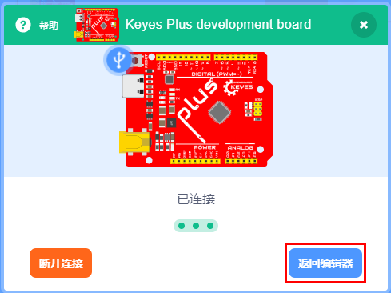

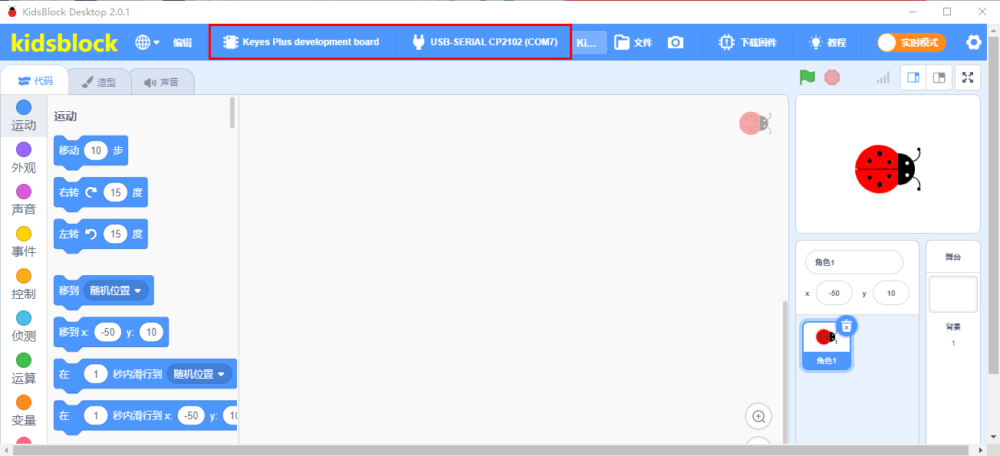

5.假如Keyes Plus development board已经连接上后，但是没有变成，则需要手动点击来连接端口（COM）。先点击，在出现的对话页面中点击“**连接**”，连接成功后，会出现“**已连接**”页面，说明端口已连接上了。

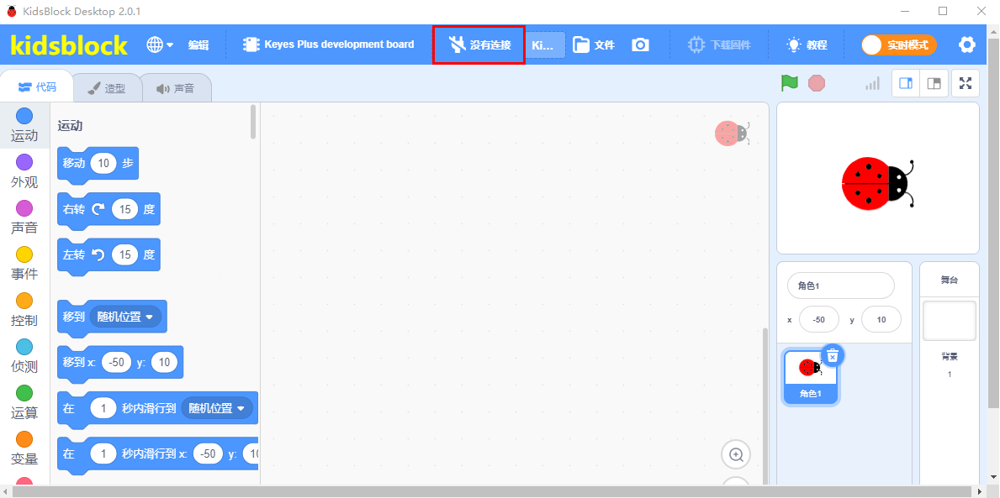

如果需要断开端口，点击，在出现的对话页面中点击“**断开连接**”。这样，端口就断开了。

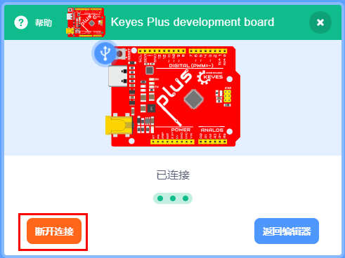

6.Keyes Plus development board和端口（COM）都已经连接上了，点击，则会自动切换成。

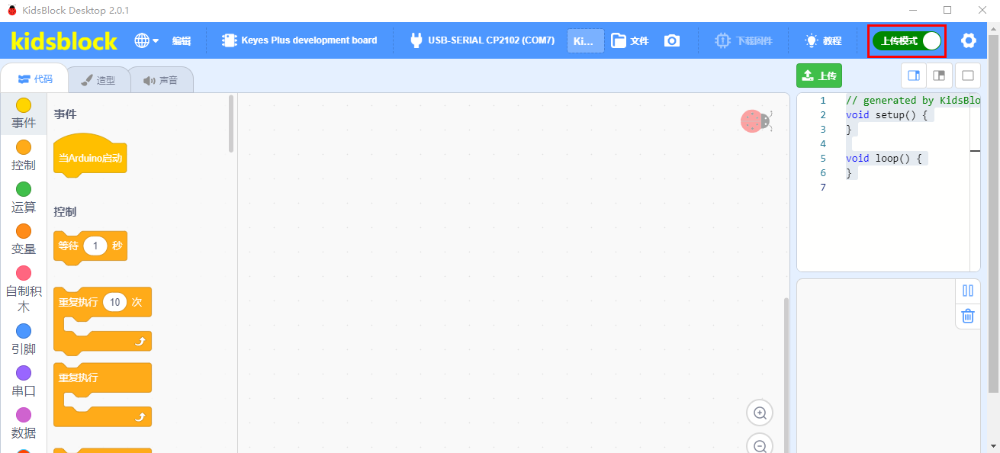

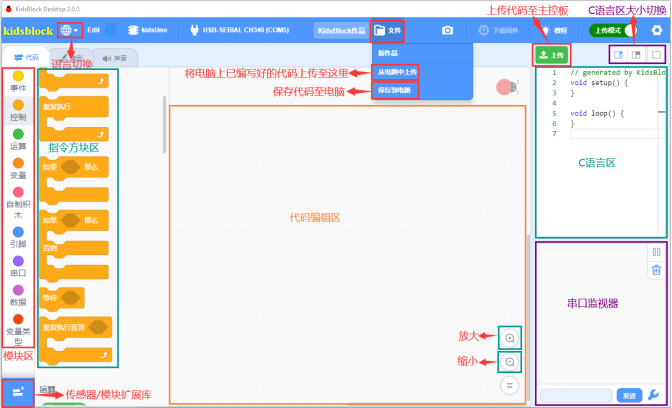

注意：如果你要更新KidsBlock软件的新库文件，需要先点击，在中点击“**清除缓存并重启**”。

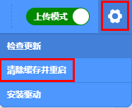   

这样，新库文件就更新了。

7.左下角的是添加传感器/模块和元件的扩展包，先点击可以进入传感器/模块扩展库界面，然后点击传感器/模块，就可以添加对应的传感器/模块。例如需要添加无源蜂鸣器模块，点击“**无源蜂鸣器**”模块，“**未加载**”变成“**已加载**”，说明“**无源蜂鸣器**”模块添加成功。

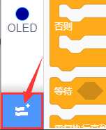

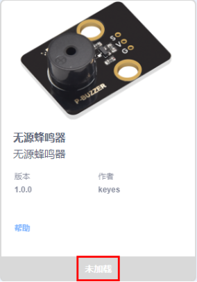

点击，可以回到代码编辑器界面，在模块区可以看到添加的“**无源蜂鸣器**”指令方块。

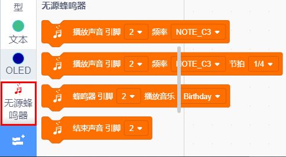

如果需要删除“**无源蜂鸣器**”模块，只需要点击再次进入传感器/模块扩展库界面，点击“**无源蜂鸣器**”模块，“**已加载**”变成“**未加载**”，则说明“**无源蜂鸣器**”模块删除成功。

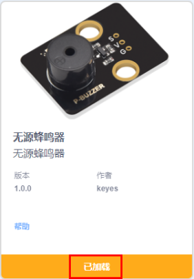

其他的传感器/模块和元器件的添加和删除，方法是一样的。

8.打开已有的SB3类型文件的方法：
方法1：鼠标左键双击SB3类型文件，这样就可以打开SB3类型文件。例如：需要打开

文件，则只需要左键双击，则文件就可以直接打开。

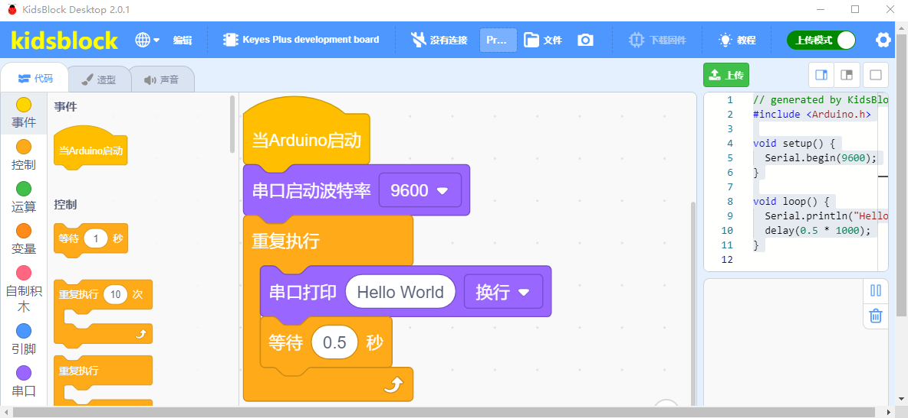

方法2：打开Kidsblock软件，先点击“**文件**”，然后选择点击“**从电脑中上传**”，在电脑上选中需要打开的SB3类型文件（例如：文件）。

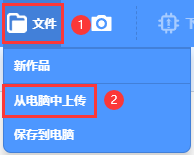

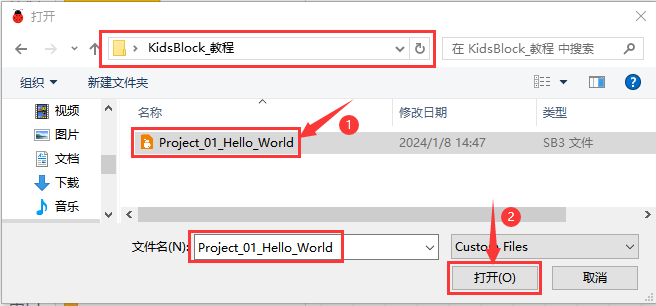

