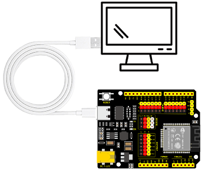

# KidsBlock 软件的下载、安装和使用方法及驱动安装方法

## 1.Windows系统软件安装

下载kidsblock：https://www.kidsblock.cn/Down/KidsBlock.exe

### windows：

## 2、Mac系统软件安装

下载kidsblock：https://www.kidsblock.cn/Down/KidsBlock-MACOS.dmg

## 3、产品和软件测试

## (**提醒：本教程在 Windows 系统下操作，采用基于ESP32开发板的智能农村产品进行演示，Mac 系统类似，其他开发板操作与此一致， 可以参照。本步骤用于测试开发板和软件是否正常工作，如果正常上传代码证明开发板正常，另外驱动已经自动安装，无需再进行驱动安装的教程学习，反之请参照驱动安装教程进行驱动安装**)

1\. 确保ESP32主控板与计算机连接成功。

## 4、软件操作介绍

#### 1、界面介绍

了解KidsBlock软件界面，有利于代码编程的学习，如下图所示：

#### 2、编写代码和上传

**确保ESP32主控板与计算机连接成功**

**方法①：** 从直接拖动代码块到代码编辑区进行代码编写，如下图所示：

单击将代码上传到ESP32主控板，如下图所示：

代码编写完成后可以选择保存到电脑供下次使用，单击 “**文件**” --> “**保存到电脑**”，如下图所示：

**方法②：** 从电脑打开已经编写好的代码。

如果您的产品包含Scartch课程，可以将我们提供的代码文件压缩包解压，把解压后的代码文件夹保存到方便使用的位置。我们提供本课程需要用到的所有代码文件，并保存到方便使用的位置。本课程以代码存放于D盘为例，路径为 <u>D:重要资源\程序代码\KidsBlock(Scratch)_代码</u>。（你也可以放入其他磁盘，只要方便示例代码导入就行）

单击 “**文件**” --> “**从电脑中上传**”，然后选择保存代码的路径，选中代码文件打开即可，如下图所示：

代码文件打开后，需要手动连接串口端口，如下图所示：

然后单击 “**返回编辑器**” 返回代码编辑区，如下图所示：

单击将代码上传到ESP32主控板，如下图所示：

## 5、驱动安装

如果无法上传代码，请参考以下教程安装驱动（选读）

1、Windows驱动安装

2、Mac驱动安装

注意：需要进行驱动安装的前提是开发板识别不到，如果可以识别到开发板，则在驱动安装过程中任何报错都可以忽略。
